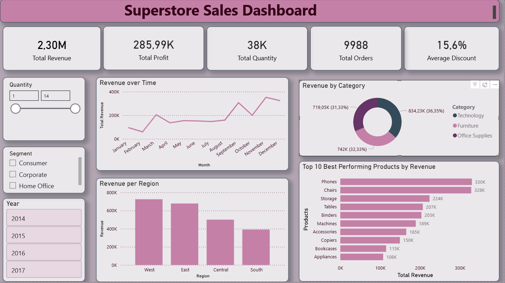

# Business Sales Perfomance Analytics

## Project Overview
This project explores a sales dataset to uncover key insights into revenue performance across time, categories, regions, and individual products.

The analysis aims to answer the following business questions:
- How has revenue changed over time?
- Which product categories generate the highest revenue?
- Which regions contribute the most to tatal revenue?
- Which products are the top revenue drivers?

## Tools Used
- Excel - Data cleaning and processing
- Power BI - Data visualization and dashboard creation
- Microsoft word - Documenting the insights and analysis
- GitHub - Project documentation and version control

## Dataset Description
The dataset contains sales transactions which includes
- Order date
- product name
- Category
- Subcategory (products)
- Sales
- Profit
- Quantity
- Discount
- Order ID
- Segment

## Data Cleaning
The dataset was cleaned in Excel by:
- Splitting data into columns
- Removing duplicates
- Removing blank rows
- Ensuring numerical values were consistent

## Dashboard Visualization
The Power BI dashboard includes the gollowing visualizations;
- Total Revenue Over Time
- Total Revenue by Category
- Total Revenue per Region
- Top 10 besty performing Products by Total Revenue

## Key Insights
- The Total Revenue experienced a slight decline between 2014 and 2015 but increased significantly afterward, reaching its highest point in 2017.
- The technology category recorded the highest total revenue among all categories, however revenue across all thee categories (technology, furniture, office supplies) is relatively balanced.
- The West region recorded the highest Total Revenue among all regions, with the East region recording the seconnd highest (relatively closre to the West) and the South Region recording the lowest Total Revenue compared to all the regions.
- Phones recorded the highest total revenue at approximately $330K in total revenue followed very closely by chairs at a total revenue of $328K, making these 2 products the biggest revenue drivers in the company.

## Dashboard Review

